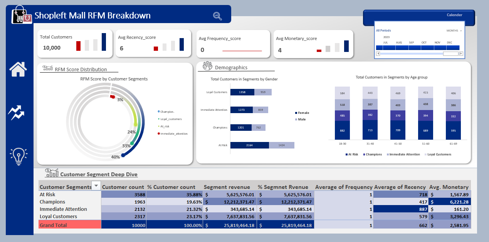

# 📊 RFM Analysis in Excel – Customer Segmentation Project Identifying High Value Shoppers

This repository houses key files and documentation for ShopLeft Mall Customer Segmentation Project. You can find the comprehensive report and in-depth documentation on Medium. [here](https://medium.com/@UjuEmmanuella/rfm-analysis-in-excel-a-complete-guide-to-customer-segmentation-a0518ccf094c).

### 🔍 Project Overview

Used Microsoft Excel to perform an RFM (Recency, Frequency, Monetary) analysis on shopping mall data from 10,000 customers. This helped uncover customer segments and create actionable strategies to improve engagement, loyalty, and revenue.

---

###  Problem Statement

ShopLeft Mall struggled with:

* Identifying high-value and loyal customers
* Spotting at-risk or inactive shoppers
* Understanding how age and gender influenced shopping behavior
* Personalizing marketing to increase repeat purchases

---

### Dataset

* **Source:** Kaggle
* **Data:** Transactions from 10 malls in Istanbul (2021–2023)
* **Sample:** 10,000 cleaned records with demographic and sales data

---

### Methodology

* **Data Cleaning:** Removed duplicates, fixed errors using Power Query
* **Feature Engineering:** Created new columns (e.g., Age Groups, Amount Spent)
* **RFM Score Calculation:** Used `PERCENTRANK.INC` in Excel for normalized scoring
* **Segmentation:** Categorized customers into 4 groups using `VLOOKUP`
* **Analysis:** Visualized insights using pivot tables and charts

---

### Key Insights

* **Champions (19.6%)**: Contribute 47% of revenue; high spenders despite low frequency
* **At Risk (35.8%)**: Haven’t purchased in a long time; low engagement, moderate revenue
* **Loyal Customers (23%)**: Steady contributors, great for upselling
* **Immediate Attention (21%)**: Low spend and high recency — need urgent re-engagement

---

### Demographic Highlights

* Women dominate all customer segments
* Younger customers (18–30) are more likely to churn
* Middle-aged customers (41–60) are more loyal and high-spending

---

### Recommendations

* **Re-engage At-Risk/Inactive customers** with personalized offers
* **Reward Champions** with VIP programs and early access deals
* **Convert Loyal Customers** into Champions through upsells
* **Boost Frequency** with loyalty incentives and post-purchase nudges
* **Tailor campaigns** based on age and gender patterns

---

📖 **For the full breakdown with step-by-step visuals and formulas, check out the detailed Medium article here:**
👉 [RFM Analysis in Excel – A Complete Guide to Customer Segmentation](https://medium.com/@UjuEmmanuella/rfm-analysis-in-excel-a-complete-guide-to-customer-segmentation-a0518ccf094c)

